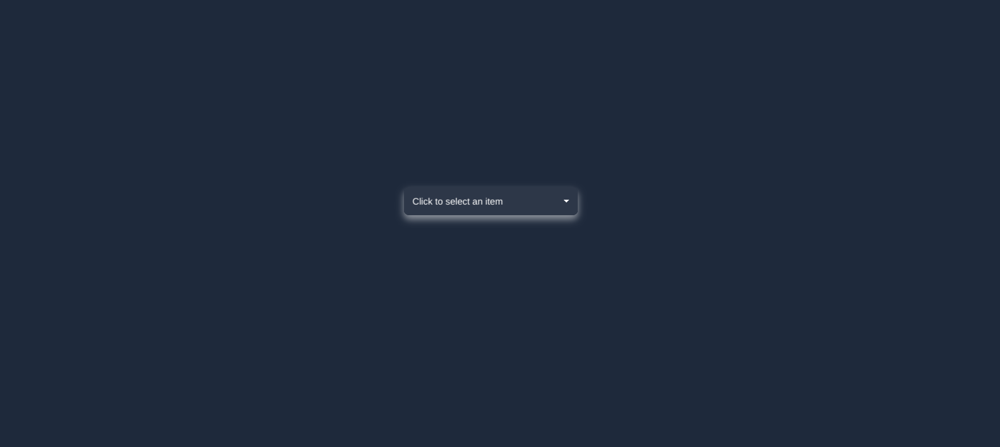

# Custom Dropdown Project 🎉

Welcome to the Custom Dropdown project! This project showcases a custom dropdown component built with HTML, CSS, and JavaScript.

## 📂 Directory Structure
```
cust_dropdown/ 
    ├── .gitignore 
    ├── index.html 
    ├── main.js 
    ├── package.json 
    ├── public/ 
    ├── README.md 
    └── style.css
```
## 🌟 Key Features

- **Custom Dropdown Component**: A fully customizable dropdown menu with smooth animations and easy-to-use API.
- **Interactive UI**: Click to open the dropdown, select an option, and see the selected option displayed.
- **Responsive Design**: Works seamlessly on both desktop and mobile devices.
- **Theme Support**: Easily customizable themes to match your application's look and feel.

## 🚀 Getting Started

To get started with the project, follow these steps:

1. **Install Dependencies**:
    ```sh
    npm install
    ```

2. **Run the Development Server**:
    ```sh
    npm run dev
    ```

3. **Build for Production**:
    ```sh
    npm run build
    ```

4. **Preview the Production Build**:
    ```sh
    npm run preview
    ```

Enjoy building with the Custom Dropdown project!

## Preview 

- Here is Screenshot of project:


## Deployment

- Soon Avaliable !!