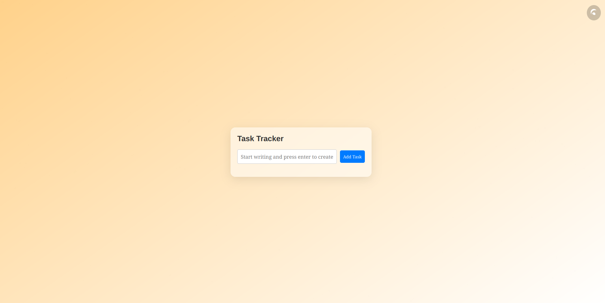

# Task Tracker Project 📝

Welcome to the Task Tracker project! This project is a simple and interactive task management application built with HTML, CSS, and JavaScript.

## 📂 Directory Structure

```
task-trackerr/ 
    ├── .gitignore 
    ├── index.html 
    ├── main.js 
    ├── package.json 
    ├── public/ 
    ├── README.md 
    └── style.css
```


## 🌟 Key Features

- **Task Management**: Add, delete, and toggle the completion status of tasks.
- **Interactive UI**: User-friendly interface with smooth animations and responsive design.
- **Theme Toggle**: Switch between light and dark themes with a single click.
- **Persistent State**: Tasks are saved in local storage, so they persist even after refreshing the page.

## 🚀 Getting Started

To get started with the project, follow these steps:

1. **Install Dependencies**:
    ```sh
    npm install
    ```

2. **Run the Development Server**:
    ```sh
    npm run dev
    ```

3. **Build for Production**:
    ```sh
    npm run build
    ```

4. **Preview the Production Build**:
    ```sh
    npm run preview
    ```

Enjoy managing your tasks with the Task Tracker project! ✅

## Preview 

- Here is Screenshot of project:


## Deployment

- Soon Avaliable !!

